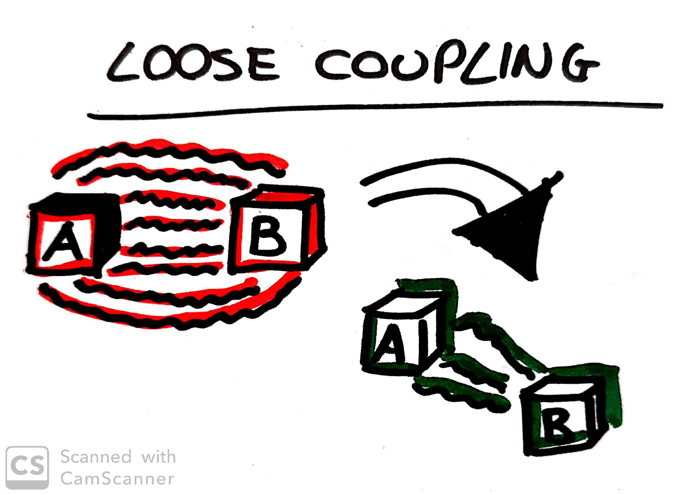
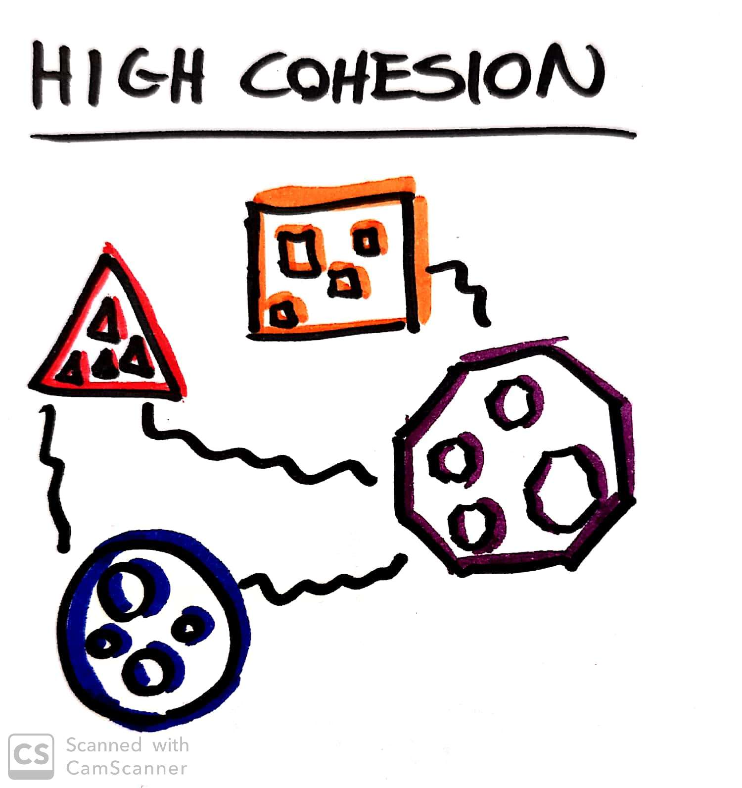

# How to Model Services

## Loose Coupling
A change to one service should not require a change to anotherì
A loosely coupled service knows as little as it needs about the service.

## High Cohesion
Related behavior has to sit together, unrelated behavior hat to sit elsewhere.
find boundaries within our problem domain that help ensure that related behavior is in one place.

## Bounded Context
_A specific responsibility enforced by explicit boundaries_
It's a thinking approach

## Ubiquitous Language
A design approach which consists of use the vocabulary of a given business domain, not only for requirements, but in discussion of design and all the way _into the product's source code itself_.

## Modules and Services
Microservices should cleanly align to bounded contexts.
In this way we ensure that our microservices are loosely coupled and stronly cohesive

## Premature Decomposition
Trying to go to microservices from the beginning is much harder than having an existing codebase you want to decompose into microservices.

## Business Capabilities
**Tinking about DATA leads to anemic, crud-based services.

You have to ask first: _What does this context do?_ and then _So, what data does it need to do that?_
