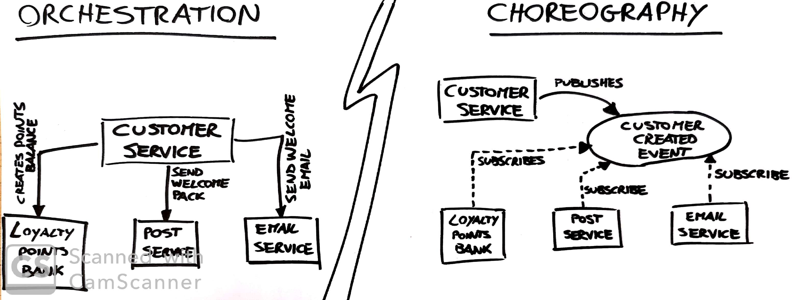

# Integration

## Looking for Ideal Integration Technology

### Avoid Breking Change
If a microservice adds new fields to a piece of data it sends out, existing consumers shouldn't be impacted.

### API Technology Agnostic
Avoid integration that dictates what technology stacks we can use to implement our microservice.

### Simple for Consumer
- Full freedom in technology
- Provide client library (keep in mind the cost of encreased coupling)

### Hide Internal Implementation Detail
Showing internal implementation details leads to increased coupling.
Internal changes may break our consumers by requiring them to also change.

## Interface with Customers

### The Shared Database
Is the most common form of integration.
Probably is the fastest form of integration to start with; this explains its popularity.

Shared Database Difficulties:
- We are allowing external parties to view and bind internal implementation details. _THIS SITUATION NORMALLY RESULTS IN REQUIRING A LARGE AMOUNT OF REGRESSION TESTING_
- The consumers are tied to a specific technology choice. We really want to ensure that implementation detail is hidden from consumers to allow our service a level of autonomy in terms of how it changes it's internal over time. _GOODBYE LOOSE COUPLING_
- The logic to perform the same sort of manipulation to a customer may now be spread among multiple consumer. If something change you have to fix every service that do the same thing. _GOODBYE COHESION_

**Sharing a database make it easy for services to share data, but does nothing about SHARING BEHAVIOUR**

### Sync vs Async
_Sync:_ request - response
_Async:_ for long running tasks, you can use an _event based collaboration_ which is _HIGHLY DECOUPLED_. The client that emit an event doesn't have any way of knowing who or what will react to it. (Internet of Things)

### Orchestration vs Choreography

_Orchestration:_ We rely on a central brain to guide and drive the process, much like the conductor in an orchestra.
  - Too much central governing authority
  - A central point where logic starts to live
_Choreography:_ We inform each part of the system of it's job, and let it work out the details, like dancers all finding their way and reacting to others around them in a ballet.
  - Explicit view of the business process is now only implicitly reflected in our system.
  - Needs a monitoring system.
  + Much more decoupled
  + To add another service to be triggered from this event, you can add it as subscriber.
  + more flexible

### Implementing Async Event-Based Collaboration
Emit and consumes Events
  -> Queues (like RabbitMQ)
  -> Atom (REST-compliant - HTTP endpoint with specification)

### Complexities of Async Architectures
  - Use a correlation ID to trace request across process boundaries
  - Have a monitoring system
  - Dead Letter Queue (with UI to see message gailed and retry them)

Read _Enterprise Integration Patterns (Addison-Wesley)_

### Services as State Machines
A microservice owns all logic associated with behaviour in ints context (Bounded Context). Our service controls all lifecycle events associated with the service's context itself.

### Reactive Extensions
Is a mechanism to compose the results of multiple calls together and run operations on them.

### DRY and the perils of code reuse in a microservice world
Don't violate DRY within a microservice, but be relaxed about violating DRY across all services.

Less shared code through service, do more duplication :)

### Client libraries
_PRO:_ (like AWS clients)
  - easy to use the service
  - avoid duplication of code required to consume the service

_CONS:_
  - logic that should exists on the server starts leaking into the client.
  - more logic into client more cohesion start to break down
      - you have to change multiple clients to rollout fixes to the server
  - limit technology choices

**If you want a Client Library**: Separate out client to handle the underlying transport protocol, which can deal with things like service discovery and failure, from things related to the destination service itself.

### Access by reference
Not pass and object, but a reference to it (like a _resource uri_ or aws:arn)

## Versioning

### Defer it for as long as possible
- Avoi making change
- choose right integration technology: _es: database integration make it **very hard** to avoid breaking change_
- Encourage good behavior in clients
- Avoid tight binding from client to service

**Postel's Law**: Be conservative in what you do, be liberal in what you accept from others

### Catch breaking changes early
- Use consumer driven contracts ([see chapter 7](./7_Testing.md))
- If you are supporting multiple different client libraries:
    - run tests using each library you support against the latest service

### Use semantic Versioning
major.minor.patch

### Coexist different endpoints
If we want to release a breaking change, we deploy a new version of the service that exposes both the old and new versions of the endpoint.

**Avoid coexisting three different versions**: use this approach to give time for other services to move to the new version, then, after all microservices use the new version, you have to remove the old endpoint.

### Use multiple concurrent service version
_**Spoiler**: not so cool_

- Use it in situation where the cost of change is too high, use it rarely.
- It's ok for a blue-green deployment.
- You have to fix and deploy 2 different services.
- Need smarts to handle directing services to the right version service.

