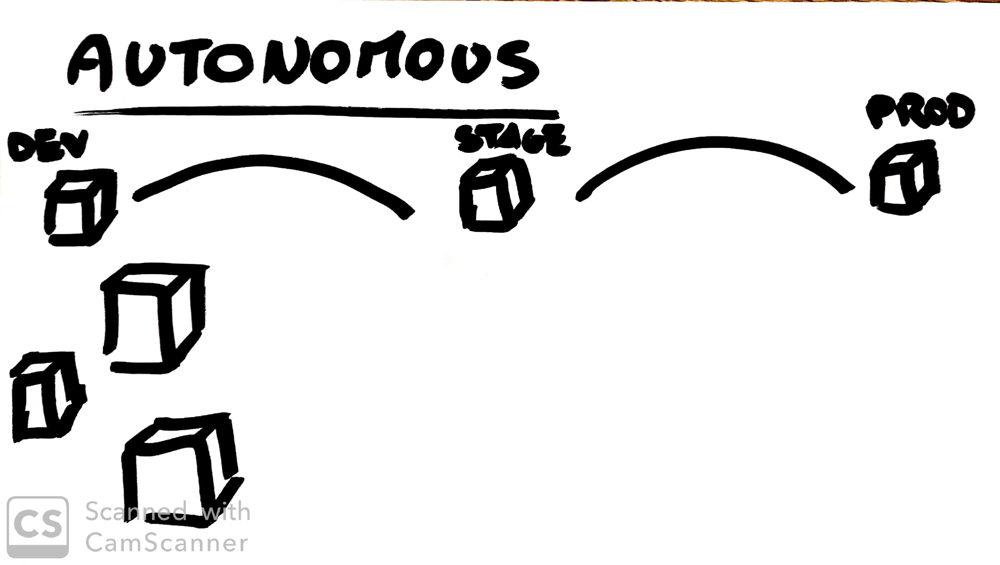

# Microservices
### **Small and focused**
Do one thing well.

### **Autonomous**
Isolated service and deployed separatedly

## Benefits
- **Technology heterogeneity**: If I really can rewrite my microservice
in two weeks, you may well mitigate the risks of embracing new technology.

- **Resilience**: is isolated, if one fails the other remains running.  
  

- **Scaling**: we can just scale those services that need scaling, allowing us to run other parts of the system on smaller, less powerful hardware

- **Composability**: small services can be used in different ways and for different purposes.
  

- **Organizational alignment**: allow us to better align our architecture to our organization, helping us minimize the number of people working on any one codebase to hit the sweet spot of team size and productivity.
  
  
- **Ease of deployment**: we can make a change to a single service and deploy it independently of the rest of the system. This allows us to get our code deployed faster.
- **Optimizing for replaceability**: Change part of a big monolyth is harder than substitute an entire service.
  

## Decompositional Techniques
Less is better, do it only if necessary. (see [Integration Chapter](./4_Integration.md))

You have two coices:
- **Using Modules**: They allow some lifecycle management of the modules, such that they can be deployed into a running process, allowing you to make changes without taking the whole process down.
- **Using Shared libraries**:
   - loose technology heterogeneity
   - reduce isolation
   - reduce ease of independent scale
